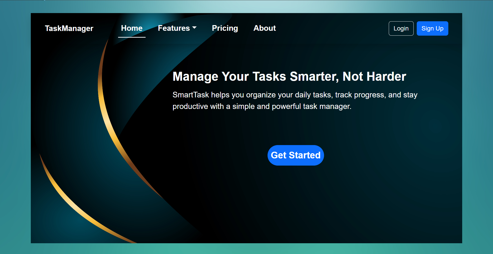
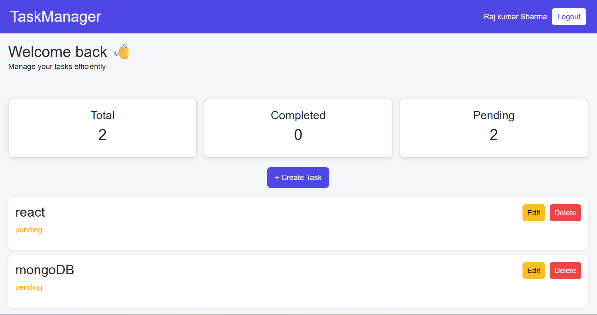
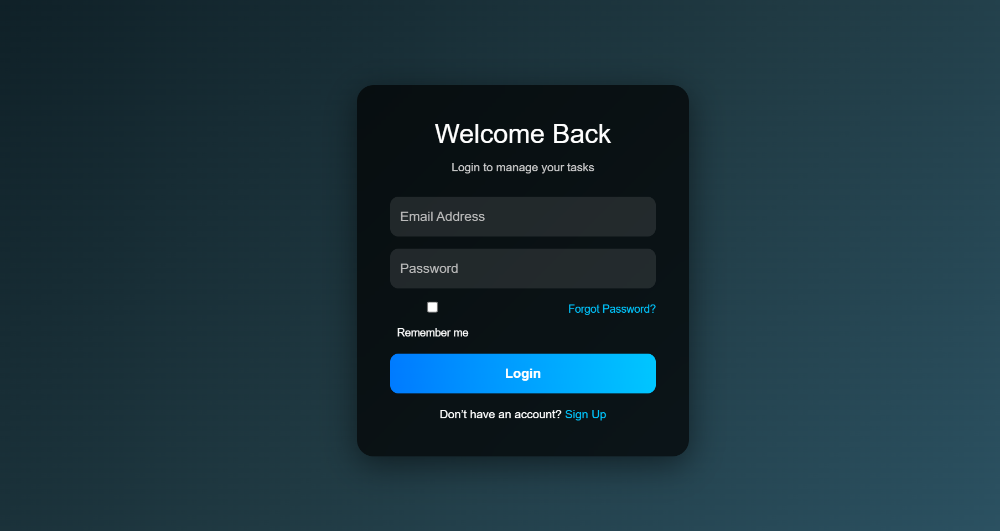
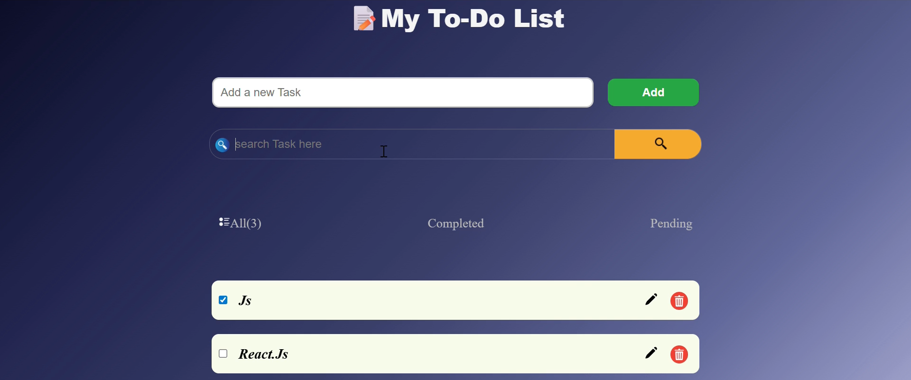
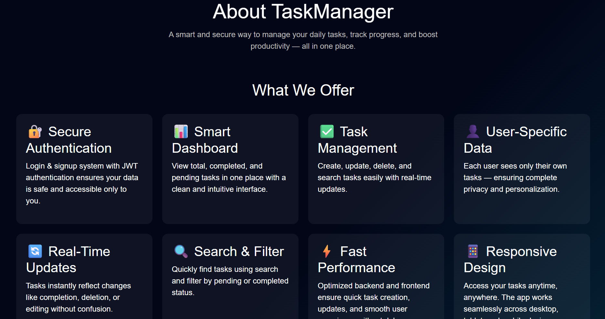

# 🧠 Smart Task Manager

A full-stack MERN application to manage daily tasks efficiently with authentication, dashboard insights, and task tracking.

---

## 🚀 Features

* 🔐 User Authentication (Signup/Login/Logout)
* ✅ Create, Read, Update, Delete Tasks
* 📊 Dashboard with task stats
* 🔍 Search and filter tasks
* 📁 Organized task categories (All / Completed / Pending)

---

## 🛠️ Tech Stack

### Frontend:

* React.js
* Redux Toolkit
* Vite
* CSS
* Bootstrap

### Backend:

* Node.js
* Express.js
* MongoDB

---

## 📁 Project Structure

```
Smart_Task/
 ├── frontpart/   # React frontend
 ├── backpart/    # Express backend
```

---

## ⚙️ Installation & Setup

### 1. Clone the repository

```
git clone https://github.com/TanushreeParhi/Smart-task-manager.git
cd your-repo-name
```

---

### 2. Setup Backend

```
cd backpart
npm install
npm start
```

---

### 3. Setup Frontend

```
cd frontpart
npm install
npm run dev
```

---

## 🔐 Environment Variables

Create a `.env` file inside backend:

```
PORT=5000
MONGO_URI=your_mongodb_connection
JWT_SECRET=your_secret_key
```

---

## ## 📸 Screenshots

### 🏠 Home Page



### 📊 Dashboard



### 🔐 Login Page



 

###  ### 📝createTask page



 

### 💡About Page



  

  

---

## 📌 Future Improvements

* Add task reminders ⏰
* Add dark mode 🌙
* Improve UI/UX

---

## 🙌 Author

* Tanushree Parhi

---

## ⭐ If you like this project

Give it a star on GitHub ⭐
